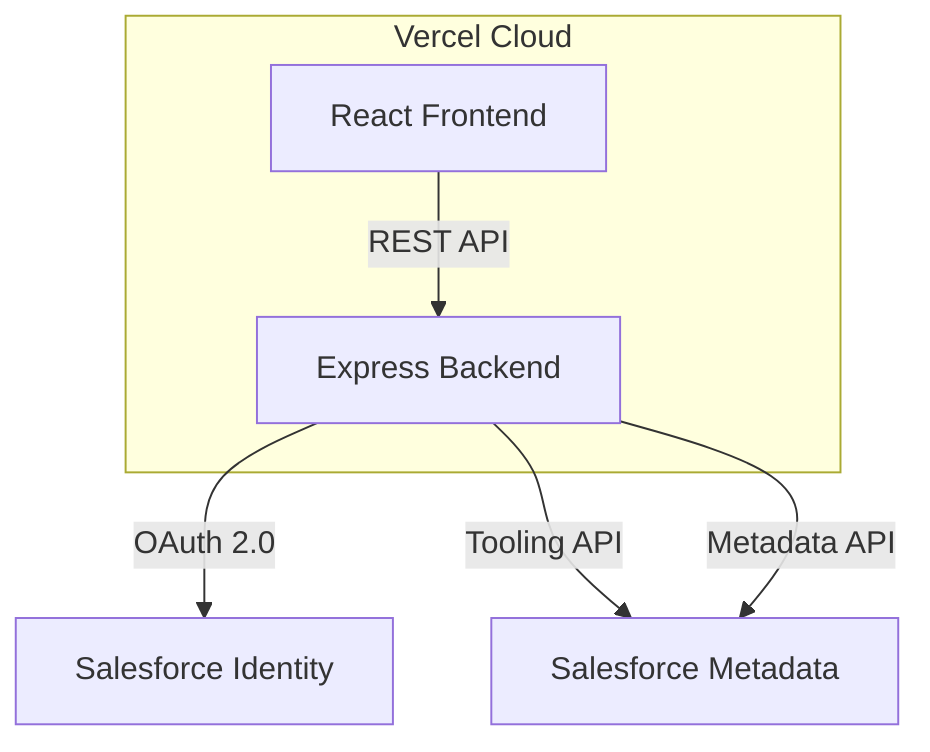

<div align="center">
  
  <h1>🚀 Salesforce Validation Rule Manager</h1>
  <p align="center">
    <strong>An ultra-modern, production-ready full-stack suite for managing Salesforce validation rules.</strong>
    <br />
    <em>Built with a futuristic glassmorphism UI and powered by JSForce.</em>
  </p>

  <p align="center">
    
    
    
    
    
  </p>

  <p align="center">
    <a href="https://salesforce-validation-rule-manager-seven.vercel.app/"><strong>Live Demo 🚀</strong></a>
  </p>
</div>

---

## ⚡ Core Highlights

- 🔐 **OAuth 2.0 Security** — Industry-standard Salesforce authentication.
- 📋 **Rule Introspection** — Real-time rule fetching via Tooling API.
- 🔀 **One-Click Deployment** — Instant Metadata API updates with optimistic UI.
- 🎨 **Futuristic UX** — Glassmorphism cards, neon gradients, and smooth Framer Motion transitions.
- 📊 **Org Analytics** — Live monitoring of org health and validation rule status.
- ☁️ **Serverless Ready** — Stateless architecture using `cookie-session` for reliable Vercel deployment.

---

## 🏗️ Architecture



---

## 🔧 Setup Guide

### 1. Salesforce Connected App
1.  **Setup** > **App Manager** > **New Connected App**.
2.  **Name**: `SF Rule Manager`.
3.  **Callback URL**: 
    - Local: `http://localhost:3001/api/auth/callback`
    - Prod: `https://your-app.vercel.app/api/auth/callback`
4.  **Scopes**: `Full access`, `Perform requests at any time`.
5.  **PKCE**: Ensure **"Require PKCE"** is **UNCHECKED**.

### 2. Environment Configuration
Create `backend/.env`:
```env
SF_CLIENT_ID=your_consumer_key
SF_CLIENT_SECRET=your_consumer_secret
SF_REDIRECT_URI=http://localhost:3001/api/auth/callback
SESSION_SECRET=a-secure-random-string
FRONTEND_URL=http://localhost:5173
NODE_ENV=development
```

### 3. Execution
```bash
# Terminal 1: Backend
cd backend && npm run dev

# Terminal 2: Frontend
cd frontend && npm run dev
```

---

## 📡 API Reference

| Endpoint | Method | Purpose |
| :--- | :--- | :--- |
| `/api/auth/salesforce` | `GET` | Initiates OAuth 2.0 Flow |
| `/api/auth/callback` | `GET` | Handles OAuth Redirection |
| `/api/validation-rules`| `GET` | Fetches Account Rules |
| `/api/deploy` | `POST`| Metadata API Deployment |
| `/api/org-info` | `GET` | Connected Org Intelligence |

---

## 🛡️ Security Posture

- **Stateless Sessions**: Tokens are encrypted and stored in `httpOnly` client-side cookies via `cookie-session`.
- **Middleware**: All API calls pass through an `authGuard` validation layer.
- **Proxy Protection**: Configured to trust Vercel's proxy layer for secure cookie handling.
- **Data Privacy**: No Salesforce credentials or customer data are persisted in any server-side database.

---

<div align="center">
  <p>Built with ❤️ for the Salesforce Ecosystem</p>
  
</div>
